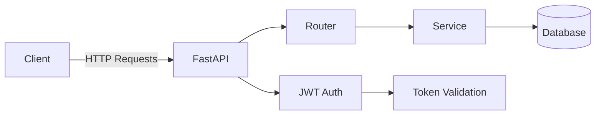

# 🚀 Task Manager API — DevOps Portfolio Project

API RESTful para gestión de tareas con autenticación JWT, desarrollada con FastAPI y diseñada como proyecto de portafolio para transición hacia **DevOps Engineering**.

---

## 🎯 Objetivo del proyecto

Este proyecto busca demostrar:

* Diseño backend con arquitectura por capas
* Seguridad con autenticación JWT
* Testing automatizado
* Integración continua (CI/CD)
* Contenerización con Docker
* Preparación para despliegue en cloud (AWS-ready)

---

## 🧱 Arquitectura



---

## 🏗️ Estructura del proyecto

```bash
app/
├── core/            # Configuración, seguridad, base de datos
├── models/          # Modelos SQLAlchemy
├── schemas/         # Esquemas Pydantic
├── services/        # Lógica de negocio
├── routers/         # Endpoints (auth, tasks)
├── dependencies/    # Dependencias (JWT, auth)

alembic/             # Migraciones de base de datos
test/                # Tests con pytest
```

---

## ⚙️ Instalación y ejecución local

### 1. Clonar el repositorio

```bash
git clone https://github.com/DanielaTola/task-manager-API.git
cd task-manager-API
```

### 2. Crear entorno virtual

```bash
python -m venv venv
source venv/bin/activate  # Mac/Linux
venv\Scripts\activate     # Windows
```

### 3. Instalar dependencias

```bash
pip install -r requirements.txt
```

---

### 4. Configurar variables de entorno

Crear un archivo `.env` basado en:

```env
DATABASE_URL=sqlite:///./task_manager.db
SECRET_KEY=your_secret_key
ALGORITHM=HS256
ACCESS_TOKEN_EXPIRE_MINUTES=30
```

---

### 5. Ejecutar migraciones

```bash
alembic upgrade head
```

---

### 6. Levantar la API

```bash
uvicorn app.main:app --reload
```

---

### 7. Acceder a la documentación

```bash
http://localhost:8000/docs
```

---

## 🔐 Autenticación (JWT)

### Flujo

1. Registro de usuario
2. Login
3. Recepción de access token
4. Uso del token en endpoints protegidos

---

### Registro

```http
POST /auth/register
```

```json
{
  "name": "Maria",
  "last_name": "Tola",
  "date_of_birth": "1999-01-01",
  "username": "maria",
  "email": "maria@test.com",
  "password": "Password123."
}
```

---

### Login

```http
POST /auth/login
```

⚠️ Importante: usar `form-data`

```
username: maria
password: Password123.
```

---

### Uso del token

```http
Authorization: Bearer <token>
```

---

## 📝 Endpoints de tareas

Todos requieren autenticación.

* `POST /tasks` → Crear tarea
* `GET /tasks` → Listar tareas del usuario
* `GET /tasks/{id}` → Obtener tarea
* `PUT /tasks/{id}` → Actualizar
* `DELETE /tasks/{id}` → Eliminar
* `PATCH /tasks/{id}` → Marcar como completada

🔐 Cada usuario solo accede a sus propias tareas (`owner_id`)

---

## 🧪 Testing

Framework: `pytest`

Características:

* Tests de endpoints
* Flujo completo con autenticación JWT
* Base de datos SQLite aislada para tests
* Cobertura con `pytest-cov`

### Ejecutar tests

```bash
pytest
```

### Ver cobertura

```bash
pytest --cov=app
```

---

## ⚙️ CI/CD (GitHub Actions)

Pipeline automatizado que ejecuta:

* Linting con Ruff
* Tests con pytest
* Validación de cobertura mínima (80%)
* Build de imagen Docker

Ubicación:

```
.github/workflows/ci.yml
```

---

## 🐳 Docker

### Build

```bash
docker build -t task-manager-api .
```

### Run

```bash
docker run -p 8000:8000 task-manager-api
```

---

## ☁️ Preparado para Cloud

Arquitectura objetivo:

* EC2 → backend
* RDS → base de datos
* S3 + CloudFront → frontend (futuro)
* GitHub Actions → CI/CD

---

## 📚 Aprendizajes

Durante este proyecto:

* Pasé de una CLI local a una API completa
* Entendí mejor separación por capas (router, service, schema)
* Implementé autenticación real con JWT
* Aprendí a testear flujos con autenticación
* Integré CI/CD y debugging de pipelines
* Experimenté errores reales (401, 422, tests fallando, etc.)

---

## 📈 Roadmap

* Refresh tokens
* Roles y permisos (RBAC)
* Observabilidad (logs y métricas)
* Deploy en AWS (EC2 + RDS)
* Infraestructura como código (Terraform)
* Kubernetes (escalabilidad)

---

## 👩‍💻 Autor

**Maria Daniela Tola Romero**
QA → DevOps Engineer 🚀

---
