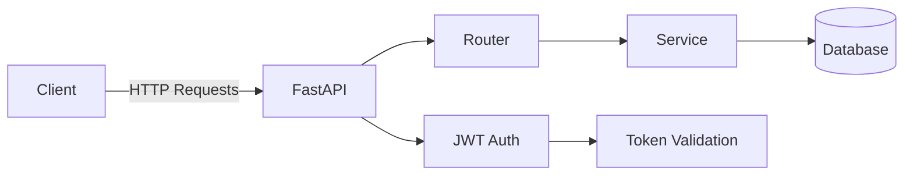

# 🚀 Task Manager API — DevOps Portfolio Project

API RESTful para gestión de tareas con autenticación JWT, diseñada siguiendo buenas prácticas de backend, testing y automatización CI/CD.

Este proyecto forma parte de mi transición profesional hacia **DevOps Engineering**, integrando desarrollo, testing automatizado y pipeline de integración continua.

---

## 🎯 Objetivo del proyecto

Construir una API moderna que demuestre:

* Diseño backend con arquitectura por capas
* Seguridad con autenticación JWT
* Testing automatizado
* Integración continua (CI)
* Contenerización con Docker
* Preparación para despliegue en cloud (AWS-ready)

---

## 🧱 Arquitectura



---

## 🏗️ Estructura del proyecto

```bash
app/
├── core/            # Configuración, seguridad, base de datos
├── models/          # Modelos SQLAlchemy
├── schemas/         # Esquemas Pydantic
├── services/        # Lógica de negocio
├── routers/         # Endpoints (auth, tasks)
├── dependencies/    # Dependencias (JWT, auth)
│
test/                # Tests con pytest
```

---

## 🔐 Seguridad (JWT)

El sistema implementa autenticación basada en tokens JWT.

### Flujo de autenticación

1. Usuario se registra
2. Usuario hace login
3. Se genera un access token
4. El cliente usa el token en cada request protegido

```bash
Authorization: Bearer <token>
```

---

## 📝 Funcionalidades

### 👤 Usuarios

* Registro (`/auth/register`)
* Login (`/auth/login`)

### 📝 Tareas (protegidas por usuario)

* Crear tarea
* Listar tareas propias
* Obtener tarea por ID
* Actualizar tarea
* Eliminar tarea
* Marcar como completada

🔐 Cada usuario solo puede acceder a sus propias tareas (`owner_id`)

---

## 🧪 Testing

Framework: `pytest`

Características:

* Tests de endpoints
* Flujo completo con autenticación JWT
* Base de datos aislada (SQLite en tests)
* Cobertura de código con `pytest-cov`

Ejecutar:

```bash
pytest
```

Cobertura:

```bash
pytest --cov=app
```

---

## ⚙️ CI/CD (GitHub Actions)

Pipeline automatizado que ejecuta:

* ✅ Linting con Ruff
* ✅ Tests automatizados
* ✅ Validación de cobertura mínima (80%)
* ✅ Build de imagen Docker

Ubicación:

```bash
.github/workflows/ci.yml
```

---

## 🐳 Docker

El proyecto está preparado para ejecutarse en contenedores.

### Build

```bash
docker build -t task-manager-api .
```

### Run

```bash
docker run -p 8000:8000 task-manager-api
```

---

## ☁️ Preparado para Cloud

El proyecto está diseñado para ser desplegado en AWS:

* EC2 → backend
* RDS → base de datos
* S3 + CloudFront → frontend (futuro)
* GitHub Actions → CI/CD

---

## 🧠 Tecnologías utilizadas

* FastAPI
* SQLAlchemy
* JWT (python-jose)
* Passlib (bcrypt)
* Pytest
* Ruff
* Docker

---

## 📈 Roadmap (mejoras futuras)

* Refresh tokens
* Roles y permisos (RBAC)
* Observabilidad (logs, métricas)
* Deploy automatizado con Terraform
* Kubernetes (escalabilidad)
* Integración con AWS (CI/CD completo)

---

## 👩‍💻 Autor

**Maria Daniela Tola Romero**
QA Engineer → DevOps Engineer 🚀

---
